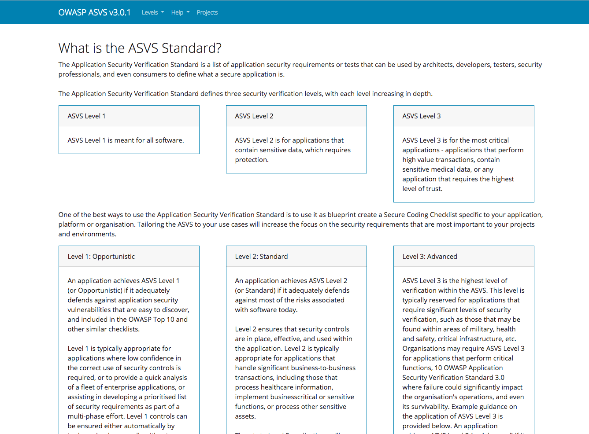
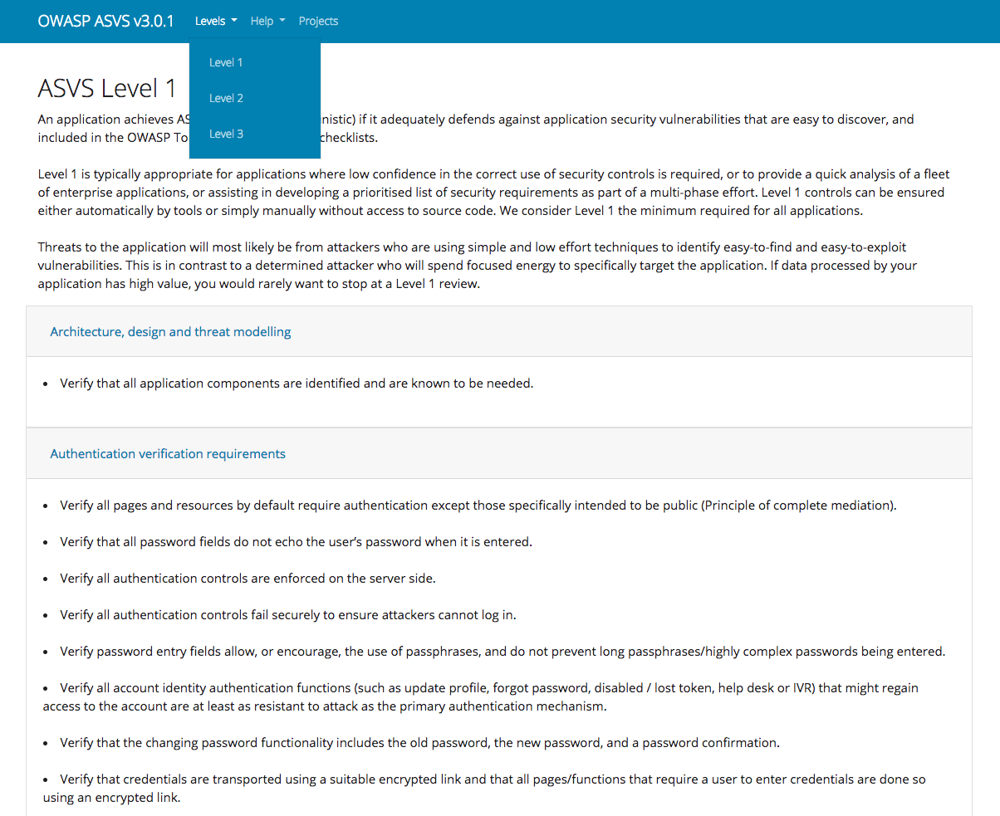
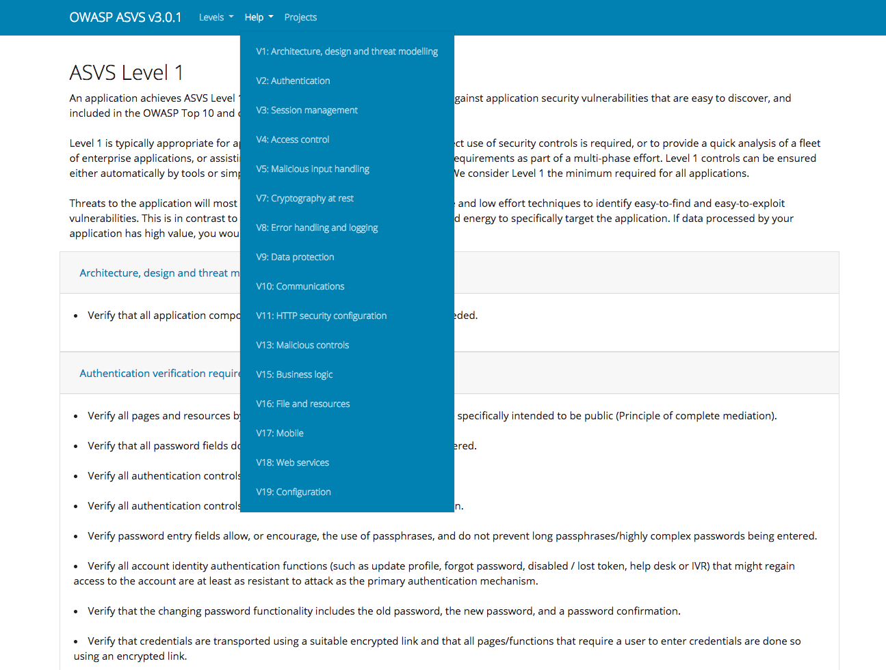
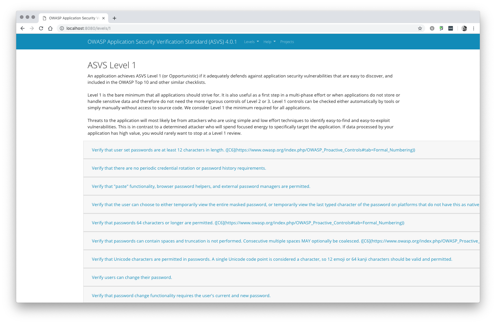
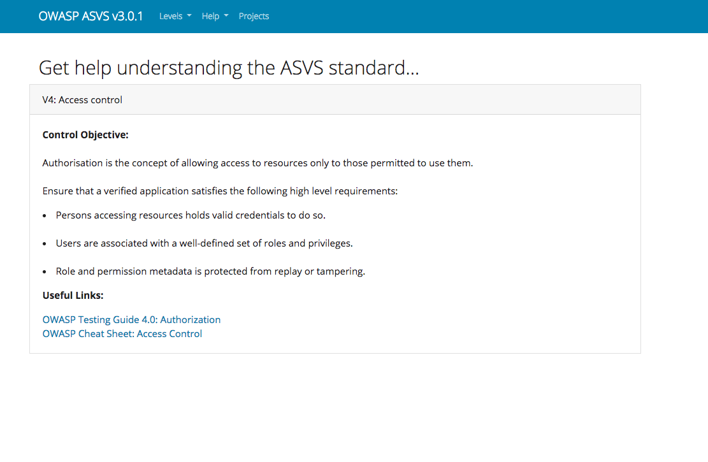

# Welcome to blah

The OWASP Application Security Verification Standard (ASVS) is a community-effort to
establish a framework of security requirements and controls that focus on normalising the functional and non-functional security controls required when designing, developing and testing modern web applications.

The ASVS is free to download as a PDF, but this is 2018 so we have taken the PDF and converted it into a web application (based on django). The key aim of the web application is to allow individuals or companies a quick and easy way to understand the ASVS controls, and where to find information on meeting those controls.

When we built [name], we wanted to try and do the following:

 - [x] Easy to update - the app is powered by two json files (asvs.json & category.json)
 - [X] Lightweight -  The included Dockerfile builds a 89MB Docker image (size isn't everything)
 - [X] No frills - You don't want a web app that takes ages to load and has "extra" stuff in it

## Installing

### Docker
Once you have cloned the repo, you can build and run the docker image with the following commands:

`docker build -t asvs .`  
`docker run -d -p 8000:8000 asvs`  
  
This will then map your local port 8000 to the running docker container.

**NOTE:** In this example we built the docker image using the tag (-t) *asvs*, however you can change this if you want.

### Other
If you want to run the web app on a "production" grade web server (such as Apache2) you can, django provides a WSGI file which you can find in the *asvs* folder. Individual installation guides for this are outside of the scope of this project, however because sharing is caring here is a [link](https://docs.djangoproject.com/en/2.0/howto/deployment/wsgi/) to the official django documentation.

## Roadmap

This is the first release and we already have some new "features" in the planning stages. These are currently (and subject to change).

1. Projects - As a developer, create a project and chose the "level" for that project. You will then be given a checklist of all the controls you should implement, with the ability to "tick" which ones have been implemented. You can then give this to your security team so validate it, and your risk team so they can accept/challenge any outstanding controls.
2. User registration and authentication (only for the project area)
3. Sharing projects between individuals
4. Teams (maybe)

## Disclaimer

This is the **first** release, as such we offer no warranties on the software and at present the following are known issues.

1. Debugging is on within the django app.
2. There is no nice error handling for missing routes.
3. The secret key is static (you many want to change that if you release to production).
4. I've only been using django for a couple of months, so yes there are probably better ways of doing things.

## Screenshots

