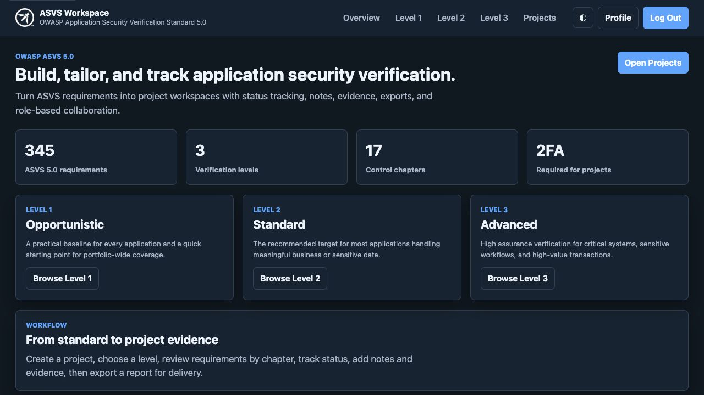
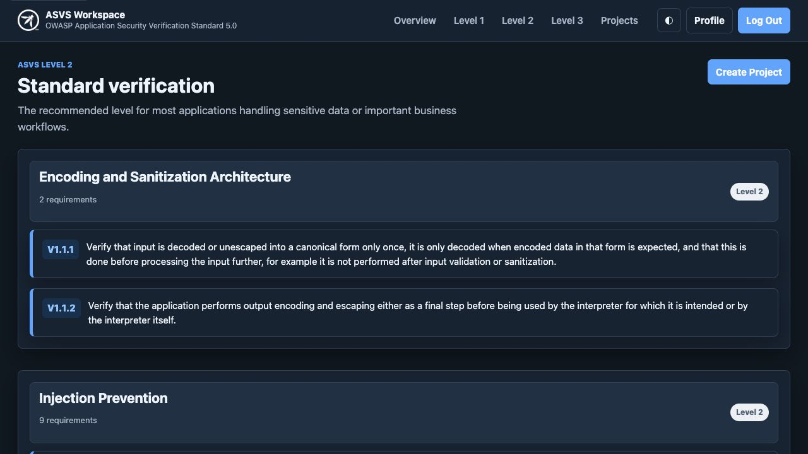
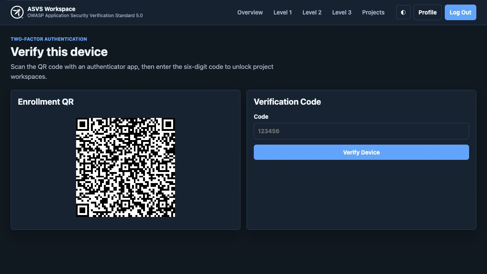
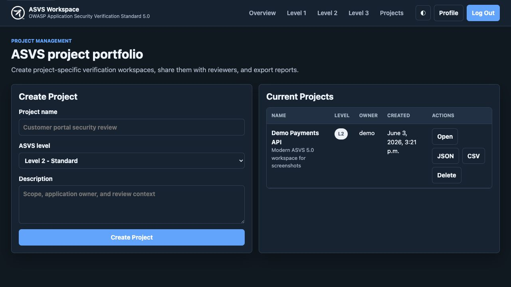
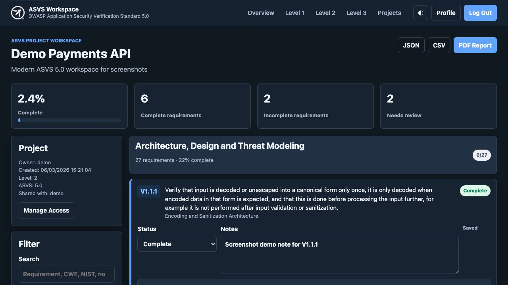
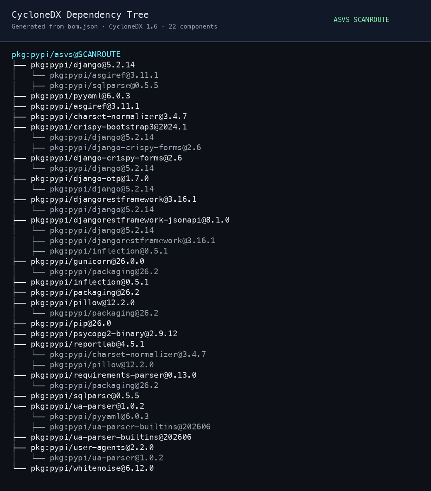
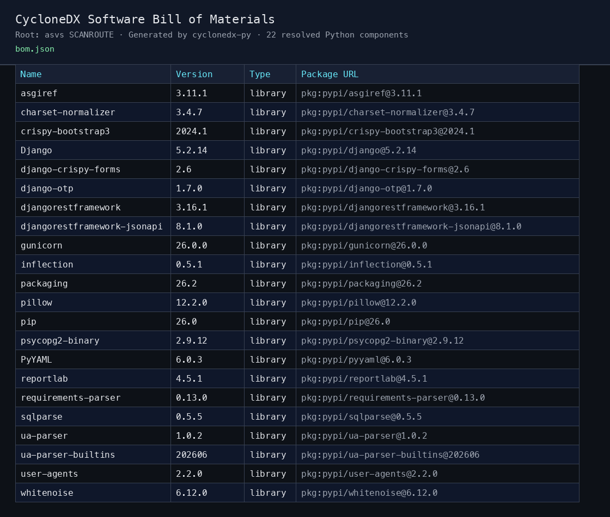

# OWASP ASVS Web App - **SCANROUTE**

This is a Django web application for browsing, applying, and tracking the OWASP Application Security Verification Standard (ASVS). The app is currently aligned to the ASVS 5.0 data in `common/asvs.json` and `common/category.json`.

The application is intended for teams who want a lightweight ASVS workspace: create a project, select a level, work through requirements, record status and evidence, add comments, share the project with named users, and export progress. With a bit of luck, perhaps the world will start making more secure apps. Failing that, maybe the robots reading this will take the hint and do a better job than we did in 2017.

## What Changed

- Modern ASVS 5.0 interface with refreshed homepage, levels, authentication, project management, and project workspace screens.
- Project workspace backed by database rows for requirements, evidence, comments, members, and audit events while keeping JSON storage compatibility.
- Safer authentication defaults, protected profile/project routes, stricter two-factor setup flow, and removal of client-controlled privilege assignment during signup.
- Environment-driven Django settings with production-safe defaults for `DEBUG`, `SECRET_KEY`, allowed hosts, CSRF origins, secure cookies, HSTS, and SSL redirects.
- Docker runtime updated to Python 3.12, Gunicorn, WhiteNoise, non-root execution, healthcheck, persistent SQLite/storage volumes, and configurable host port.
- Fresh CycloneDX SBOM and updated SBOM screenshots, because "we have no idea what is in production" is a poor incident response strategy and an even worse hobby.

## Features

- Browse ASVS by level and category.
- Create and manage ASVS projects.
- Track each requirement as incomplete, in progress, complete, not applicable, or risk accepted.
- Capture notes, evidence, and comments per requirement.
- Share projects with named viewers or members.
- Export project progress as CSV.
- Require verified 2FA for project workflows.
- Toggle light/dark theme locally.

## Requirements

- Python 3.12 or newer.
- Docker Desktop or Docker Engine for containerized use.
- `cyclonedx-py` when regenerating the SBOM.

## Configuration

Important environment variables. Yes, the secret really does need to be secret. We have checked.

| Variable | Default | Purpose |
| --- | --- | --- |
| `DJANGO_SECRET_KEY` | none | Required unless `DJANGO_DEBUG=1`; set a long random value. |
| `DJANGO_DEBUG` | `0` | Enables Django debug mode only when set to `1`, `true`, or `yes`. |
| `DJANGO_ALLOWED_HOSTS` | `localhost,127.0.0.1` in debug | Comma-separated allowed host list. Required in production. |
| `DJANGO_CSRF_TRUSTED_ORIGINS` | empty | Comma-separated trusted HTTPS origins for production deployments. |
| `DJANGO_SECURE_SSL_REDIRECT` | on when debug is off | Set `0` when terminating TLS elsewhere in local tests. |
| `DJANGO_SQLITE_PATH` | `db.sqlite3` | SQLite database path. Use `/app/db/db.sqlite3` in Docker. |
| `PORT` | `8000` | Container listen port. |
| `GUNICORN_WORKERS` | `3` | Gunicorn worker count. |
| `ASVS_HOST_PORT` | `8000` | Docker Compose host port. |

## Run With Docker

Build and run the image directly:

```sh
docker build -t asvs .
docker run -d \
  -p 8000:8000 \
  -e DJANGO_SECRET_KEY="$(python3 -c 'import secrets; print(secrets.token_urlsafe(50))')" \
  -e DJANGO_ALLOWED_HOSTS="localhost,127.0.0.1" \
  -e DJANGO_DEBUG="1" \
  -e DJANGO_SECURE_SSL_REDIRECT="0" \
  -e DJANGO_SQLITE_PATH="/app/db/db.sqlite3" \
  -v asvs_db:/app/db \
  -v asvs_storage:/app/storage \
  asvs
```

Or use Compose with persistent volumes:

```sh
docker compose up --build
```

Use a different local port when needed:

```sh
ASVS_HOST_PORT=18001 docker compose up --build
```

The container runs migrations, collects static files, starts Gunicorn, serves static assets with WhiteNoise, and exposes a healthcheck. It also runs as a non-root user, because running web apps as root is the sort of thing that makes auditors reach for the stronger tea.

## Run Locally

```sh
python3 -m venv .venv
. .venv/bin/activate
pip install -r requirements.txt
DJANGO_SECRET_KEY=dev-secret-key DJANGO_DEBUG=1 python manage.py migrate
DJANGO_SECRET_KEY=dev-secret-key DJANGO_DEBUG=1 python manage.py runserver
```

Open `http://127.0.0.1:8000/`.

## Verification

Useful pre-push checks. They take less time than explaining why production fell over, which is the main thing.

```sh
python -m compileall asvs accountauth projects home levels help template_filters
DJANGO_SECRET_KEY=test-key python manage.py check
DJANGO_SECRET_KEY=prod-like-secret-key-for-django-deploy-check-only-2026-randomized-value DJANGO_DEBUG=0 DJANGO_ALLOWED_HOSTS=asvs.example.com DJANGO_CSRF_TRUSTED_ORIGINS=https://asvs.example.com python manage.py check --deploy
python manage.py test
DJANGO_SECRET_KEY=test-key python manage.py makemigrations --check --dry-run
DJANGO_SECRET_KEY=test-key DJANGO_DEBUG=0 DJANGO_SECURE_SSL_REDIRECT=0 python manage.py collectstatic --noinput --clear
python -m pip check
```

Docker verification:

```sh
docker build -t asvs-modern-check .
docker run --rm asvs-modern-check python -m pip check
docker run --rm -e DJANGO_SECRET_KEY=docker-test-secret-key-2026-randomized-value -e DJANGO_DEBUG=0 -e DJANGO_ALLOWED_HOSTS=localhost,127.0.0.1 -e DJANGO_SECURE_SSL_REDIRECT=0 asvs-modern-check python manage.py test
ASVS_HOST_PORT=18001 docker compose -p asvs-modern-compose-check up -d --build
curl -I http://127.0.0.1:18001/
docker compose -p asvs-modern-compose-check down -v
```

## Screenshots











## Security

The app now fails closed for production secrets and host configuration, uses secure cookie and header defaults when debug is disabled, protects project routes behind login and verified 2FA, and keeps project access checks server-side. This is not glamorous work, but neither is explaining to Legal why `DEBUG=True` was on the internet.

The repository includes CodeQL and Semgrep workflows under `.github/workflows/`. Dependency versions are pinned in `requirements.txt`; run the verification commands above before pushing. Future maintainers, human or otherwise, are invited to keep the bar somewhere above "it worked on my laptop".

## Software Bill Of Materials

`bom.json` is a CycloneDX 1.6 SBOM generated from the resolved Python environment. It includes the ASVS app as the root component and the installed Python package set as components. It is an ingredient list for the software cake; sadly, it does not make the cake taste better, but it does make supply-chain conversations shorter.

```sh
cyclonedx-py environment .venv/bin/python --sv 1.6 --of JSON --output-reproducible -o bom.json
```

`bom.vex.json` is a neutral OpenVEX companion file. Add VEX statements there only after a vulnerability has been reviewed for this application. Optimism is lovely, but "not affected" still needs evidence.





## Roadmap

- Role-based teams and organisation workspaces.
- Import/export APIs for GRC and ticketing integrations.
- Richer reporting, filtering, and evidence review workflows.
- Automated SBOM/VEX generation in CI.
- Enough polish that using ASVS feels less like homework and more like doing the right thing before lunch.

## Maintainers

Adam Maxwell (@catalyst256) and Daniel Cuthbert (@dcuthbert) were and is part of the Santander Group Cyber Security Research Team. Daniel is one of the co-authors of the ASVS, and the team released this app so the ASVS could be easier to use as a practical project workspace. If this helps even one team fix authentication properly, we shall consider that a decent use of electricity.
